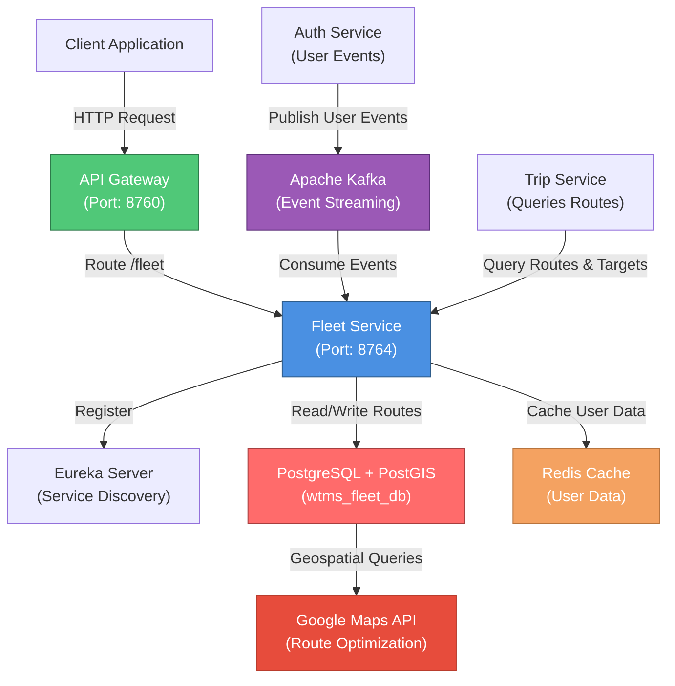
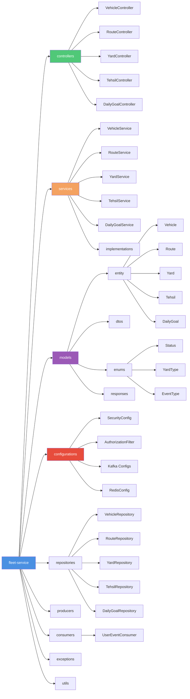
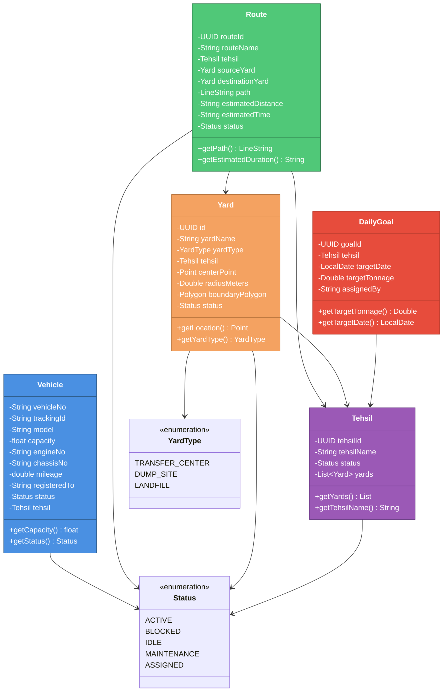

# Fleet Service - WTMS (Waste Transportation Management System)

## Service Overview

The **Fleet Service** is the core fleet, route, and resource management microservice within the WTMS ecosystem. It manages all operational aspects of waste transportation infrastructure, including vehicle fleet management, collection routes with geospatial data, collection yards, administrative divisions (Tehsils), and daily collection targets.

### Key Responsibilities

- **Vehicle Fleet Management**: Maintains comprehensive vehicle inventory with tracking IDs, capacity, maintenance status, and assignment to Tehsils
- **Geospatial Route Management**: Manages waste collection routes with geographic coordinates, estimated distances/times using JTS and Hibernate Spatial
- **Collection Yard Management**: Oversees transfer centers (TCP) and dump sites with geographic boundaries and center points
- **Administrative Hierarchy**: Manages Tehsil (district) divisions and their associated yards and routes
- **Daily Collection Targets**: Sets and manages daily waste collection targets (tonnage goals) for each Tehsil
- **Real-Time User Data Caching**: Consumes user status events from Auth Service and caches in Redis for quick lookups
- **Cross-Service Integration**: Provides endpoints for Trip Service to query daily targets and vehicle availability
- **Status Tracking**: Manages status of vehicles (ACTIVE, BLOCKED, IDLE, MAINTENANCE, ASSIGNED), routes, and yards
- **Google Maps Integration**: Leverages Google Maps Services for route optimization and distance calculations

### Business Context

The Fleet Service acts as the **resource orchestration layer** for WTMS. It maintains the master inventory of waste transportation infrastructure and provides critical operational information to other services. Trip Service queries this service for route information and daily targets, while the system depends on accurate fleet data for effective route planning and supervision.

---

## Architecture & Design

### High-Level Architecture Diagram



### Package Diagram (Internal Structure)



### Class Diagram (Core Domain Model)



---

## Setup & Execution

### Prerequisites

Ensure the following services and tools are installed and running on your machine:

- **Java Development Kit (JDK)**: Version 17 or higher
- **Apache Maven**: Version 3.8.1 or higher
- **PostgreSQL with PostGIS**: Version 13+ with geospatial extension
- **Apache Kafka**: Version 3.0+ (for event streaming)
- **Redis**: Version 6.0+ (for user data caching)
- **Eureka Server**: Running on `http://localhost:8761/eureka/` (for service discovery)
- **Google Maps API Key**: For route optimization and geospatial calculations

### Step 1: Clone the Repository

```bash
git clone <repository-url>
cd BackEnd/fleet-service
```

### Step 2: Configure PostgreSQL with PostGIS

Enable PostGIS extension for geospatial queries:

```sql
-- Connect to wtms_fleet_db
CREATE EXTENSION IF NOT EXISTS postgis;

-- Verify PostGIS is enabled
SELECT postgis_version();
```

### Step 3: Configure Environment Variables

Update `src/main/resources/application.properties` with your environment-specific values:

```properties
# Database Configuration (PostgreSQL with PostGIS)
spring.datasource.url=jdbc:postgresql://localhost:5432/wtms_fleet_db
spring.datasource.username=admin
spring.datasource.password=your_strong_password

# Google Maps API Configuration
google.maps.api.key=your_google_maps_api_key

# JWT Configuration (for token validation)
jwt.public-key.path=classpath:certs/public_key.pem
app.security.internal-secret=your_secret_key

# Kafka Configuration
kafka.bootstrap.server=localhost:9092
kafka.consumer.group=fleet-group

# Redis Configuration
spring.data.redis.host=localhost
spring.data.redis.port=6379
spring.data.redis.database=2

# Eureka Configuration
eureka.client.service-url.defaultZone=http://localhost:8761/eureka/
```

### Step 4: Build the Service

```bash
# Clean and build with Maven
mvn clean install

# Or skip tests for faster build
mvn clean install -DskipTests
```

### Step 5: Run the Service Locally

```bash
# Option 1: Using Maven Spring Boot plugin
mvn spring-boot:run

# Option 2: Run the generated JAR
java -jar target/fleet-service-0.0.1-SNAPSHOT.jar
```

### Step 6: Verify the Service

Once the service is running, verify its status:

```bash
# Health Check
curl -X GET http://localhost:8764/actuator/health

# Check Eureka Registration
curl -X GET http://localhost:8761/eureka/apps/fleet-service

# Swagger UI (OpenAPI Documentation)
# Open in browser: http://localhost:8764/swagger-ui.html
```

### Default Port Configuration

| Service | Port | Description |
|---------|------|-------------|
| Fleet Service | `8764` | Vehicle, Route & Resource Management |
| Eureka Server | `8761` | Service Discovery |
| Kafka | `9092` | Event Streaming |
| PostgreSQL | `5432` | Fleet & Route Database (PostGIS) |
| Redis | `6379` | User Data Cache |

---

## Environment Variables & Application Properties

### Required Configuration Table

| Property | Type | Default | Description | Example |
|----------|------|---------|-------------|---------|
| `spring.application.name` | String | `fleet-service` | Microservice identifier | `fleet-service` |
| `server.port` | Integer | `8764` | HTTP server port | `8764` |
| `spring.datasource.url` | String | Required | PostgreSQL connection URL with PostGIS | `jdbc:postgresql://localhost:5432/wtms_fleet_db` |
| `spring.datasource.username` | String | Required | Database username | `admin` |
| `spring.datasource.password` | String | Required | Database password (strong) | `your_strong_password` |
| `spring.jpa.database-platform` | String | PostGIS | Hibernate dialect for PostGIS | `org.hibernate.dialect.PostgreSQLDialect` |
| `spring.jpa.hibernate.ddl-auto` | String | `update` | Schema generation strategy | `update` / `create` / `validate` |
| `google.maps.api.key` | String | Required | Google Maps API key for route calculations | `AIzaSy...` |
| `jwt.public-key.path` | String | Required | Path to RSA public key (PEM) | `classpath:certs/public_key.pem` |
| `app.security.internal-secret` | String | Required | Internal API secret key (minimum 32 chars) | `yK8!pL3@xQ7#dT9$wF2^sR5&vM1*bN6(` |
| `kafka.bootstrap.server` | String | Required | Kafka broker address | `localhost:9092` |
| `kafka.consumer.group` | String | `fleet-group` | Kafka consumer group ID | `fleet-group` |
| `spring.data.redis.host` | String | Required | Redis server hostname | `localhost` |
| `spring.data.redis.port` | Integer | `6379` | Redis server port | `6379` |
| `spring.data.redis.database` | Integer | `2` | Redis database number | `2` |
| `eureka.client.register-with-eureka` | Boolean | `true` | Register service with Eureka | `true` |
| `eureka.client.service-url.defaultZone` | String | Required | Eureka server URL | `http://localhost:8761/eureka/` |
| `eureka.instance.prefer-ip-address` | Boolean | `true` | Use IP address instead of hostname | `true` |
| `management.tracing.sampling.probability` | Float | `1.0` | Distributed tracing sample rate (0.0-1.0) | `1.0` |
| `logging.level.org.hibernate.SQL` | String | `DEBUG` | Hibernate SQL logging level | `DEBUG` / `INFO` |
| `spring.jpa.show-sql` | Boolean | `false` | Print SQL statements to console | `false` / `true` |

### Kafka Topics Configuration

| Topic | Consumer Group | Purpose |
|-------|----------------|---------|
| `user-response-topic` | `fleet-group` | User status and profile events from Auth/User Service |

---

## API Endpoints

### Vehicle Management Endpoints

| HTTP Method | Endpoint | Role Required | Description | Request Body | Response |
|-------------|----------|---------------|-------------|--------------|----------|
| `POST` | `/fleet/vehicle/add` | `ADMIN` | Add new vehicle to fleet | `{ "vehicleNo": "string", "trackingId": "string", "model": "string", "capacity": "float", "engineNo": "string", "chassisNo": "string", "registeredTo": "string", "tehsilId": "UUID" }` | `{ "vehicleNo": "string", "model": "string", "capacity": "float", "status": "string" }` |
| `PATCH` | `/fleet/vehicle/update/{vehicleNo}` | `ADMIN` | Update vehicle details | `{ "field": "value" }` | HTTP 204 No Content |
| `PATCH` | `/fleet/vehicle/block/{vehicleNo}` | `ADMIN` | Block/Unblock vehicle (status = BLOCKED) | `blockStatus: boolean` (query param) | HTTP 204 No Content |
| `GET` | `/fleet/vehicle/all` | `ADMIN`, `SUPERVISOR` | Retrieve all vehicles | None | `[ { vehicle objects } ]` |
| `GET` | `/fleet/vehicle/{vehicleNo}` | `ADMIN`, `SUPERVISOR` | Retrieve specific vehicle by registration number | None | `{ vehicle object }` |

### Route Management Endpoints

| HTTP Method | Endpoint | Role Required | Description | Request Body | Response |
|-------------|----------|---------------|-------------|--------------|----------|
| `POST` | `/fleet/route/add` | `ADMIN` | Create new waste collection route | `{ "routeName": "string", "tehsilId": "UUID", "sourceYardId": "UUID", "destinationYardId": "UUID", "pathCoordinates": [ [...] ], "estimatedDistance": "string", "estimatedTime": "string" }` | `{ "routeId": "UUID", "routeName": "string", "tehsilId": "UUID", "status": "string" }` |
| `PATCH` | `/fleet/route/update/{id}` | `ADMIN` | Update route information | `{ "routeName": "string", ... }` | HTTP 200 OK |
| `PATCH` | `/fleet/route/block/{id}` | `ADMIN` | Block/Unblock route | `blockStatus: boolean` (query param) | HTTP 204 No Content |
| `GET` | `/fleet/route/{id}` | `ADMIN`, `SUPERVISOR` | Retrieve specific route with geospatial data | None | `{ "routeId": "UUID", "routeName": "string", "path": "LineString", "estimatedDistance": "string", "estimatedTime": "string", "status": "string" }` |
| `GET` | `/fleet/route/all` | `ADMIN`, `SUPERVISOR` | Retrieve all routes | None | `[ { route objects } ]` |

### Yard Management Endpoints

| HTTP Method | Endpoint | Role Required | Description | Request Body | Response |
|-------------|----------|---------------|-------------|--------------|----------|
| `POST` | `/fleet/yard/add` | `ADMIN` | Create new transfer center or dump site | `{ "yardName": "string", "yardType": "enum", "tehsilId": "UUID", "centerPoint": "Point", "radiusMeters": "double", "boundaryPolygon": "Polygon" }` | `{ "yardId": "UUID", "yardName": "string", "yardType": "string", "status": "string" }` |
| `PATCH` | `/fleet/yard/update/{id}` | `ADMIN` | Update yard information | `{ "yardName": "string", ... }` | HTTP 204 No Content |
| `GET` | `/fleet/yard/{id}` | `ADMIN`, `SUPERVISOR` | Retrieve specific yard with geospatial boundaries | None | `{ "yardId": "UUID", "yardName": "string", "yardType": "string", "centerPoint": "Point", "boundaryPolygon": "Polygon" }` |
| `GET` | `/fleet/yard/all` | `ADMIN`, `SUPERVISOR` | Retrieve all yards | None | `[ { yard objects } ]` |

### Tehsil Management Endpoints

| HTTP Method | Endpoint | Role Required | Description | Request Body | Response |
|-------------|----------|---------------|-------------|--------------|----------|
| `POST` | `/fleet/tehsil/add` | `ADMIN` | Create new Tehsil (district) | `{ "tehsilName": "string" }` | `{ "tehsilId": "UUID", "tehsilName": "string", "status": "string" }` |
| `PATCH` | `/fleet/tehsil/update/{id}` | `ADMIN` | Update Tehsil information | `{ "tehsilName": "string" }` | HTTP 204 No Content |
| `GET` | `/fleet/tehsil/{id}` | `ADMIN`, `SUPERVISOR` | Retrieve Tehsil with all associated yards | None | `{ "tehsilId": "UUID", "tehsilName": "string", "yards": [ { yard objects } ] }` |
| `GET` | `/fleet/tehsil/all` | `ADMIN`, `SUPERVISOR` | Retrieve all Tehsils | None | `[ { tehsil objects } ]` |

### Daily Goal Management Endpoints

| HTTP Method | Endpoint | Role Required | Description | Request Body | Response |
|-------------|----------|---------------|-------------|--------------|----------|
| `POST` | `/fleet/goals` | Authenticated | Set daily collection target for a Tehsil | `{ "tehsilId": "UUID", "targetDate": "LocalDate", "targetTonnage": "Double", "assignedBy": "string" }` | HTTP 201 Created, `{ "goalId": "UUID", "targetTonnage": "Double", "targetDate": "LocalDate" }` |
| `GET` | `/fleet/goals/tehsil/{tehsilId}` | Authenticated | Get all goals for a specific Tehsil | None | `[ { goal objects } ]` |
| `GET` | `/fleet/goals/target` | Authenticated | **Microservice Endpoint**: Get daily target tonnage for cross-service queries | `tehsilId` (param), `date` (param) | `Double` (tonnage value) |
| `GET` | `/fleet/goals` | Authenticated | Get all daily goals across all Tehsils | None | `[ { goal objects } ]` |

### Health & Monitoring Endpoints

| HTTP Method | Endpoint | Description | Response |
|-------------|----------|-------------|----------|
| `GET` | `/actuator/health` | Service health status | `{ "status": "UP/DOWN", "components": {...} }` |
| `GET` | `/actuator/metrics` | Application metrics | Micrometer metrics |
| `GET` | `/swagger-ui.html` | OpenAPI (Swagger) documentation | Interactive API documentation |

### Example API Requests

#### Add New Vehicle
```bash
curl -X POST http://localhost:8764/fleet/vehicle/add \
  -H "Content-Type: application/json" \
  -H "Authorization: Bearer <admin_jwt_token>" \
  -d '{
    "vehicleNo": "PKI-123",
    "trackingId": "TRK-001",
    "model": "Hino Compactor",
    "capacity": 15.5,
    "engineNo": "ENGINE-001",
    "chassisNo": "CHASSIS-001",
    "registeredTo": "Islamabad Waste Management",
    "tehsilId": "550e8400-e29b-41d4-a716-446655440000"
  }'
```

#### Create Collection Route
```bash
curl -X POST http://localhost:8764/fleet/route/add \
  -H "Content-Type: application/json" \
  -H "Authorization: Bearer <admin_jwt_token>" \
  -d '{
    "routeName": "G7 to Losar Route",
    "tehsilId": "550e8400-e29b-41d4-a716-446655440000",
    "sourceYardId": "550e8400-e29b-41d4-a716-446655440001",
    "destinationYardId": "550e8400-e29b-41d4-a716-446655440002",
    "estimatedDistance": "12.5 km",
    "estimatedTime": "45 minutes"
  }'
```

#### Set Daily Collection Target
```bash
curl -X POST http://localhost:8764/fleet/goals \
  -H "Content-Type: application/json" \
  -H "Authorization: Bearer <jwt_token>" \
  -d '{
    "tehsilId": "550e8400-e29b-41d4-a716-446655440000",
    "targetDate": "2026-06-22",
    "targetTonnage": 150.0,
    "assignedBy": "admin_001"
  }'
```

#### Query Daily Target (Cross-Service)
```bash
curl -X GET "http://localhost:8764/fleet/goals/target?tehsilId=550e8400-e29b-41d4-a716-446655440000&date=2026-06-22" \
  -H "Authorization: Bearer <jwt_token>"
```

---

## Test Cases & Documentation

### Core Test Scenarios

| Scenario ID | Category | Scenario Description | Input Parameters | Expected Output | Validation Type |
|-------------|----------|----------------------|-------------------|------------------|-----------------|
| **FLEET-TC-001** | Vehicle Management | Add new vehicle to fleet successfully | VehicleRequest with all required fields | HTTP 201 Created, vehicle created with status ACTIVE | Integration Test |
| **FLEET-TC-002** | Vehicle Management | Add vehicle with duplicate vehicle number | VehicleRequest with existing vehicleNo | HTTP 409 Conflict, "Vehicle already exists" | Integration Test |
| **FLEET-TC-003** | Vehicle Management | Update vehicle details (model, capacity) | vehicleNo = existing, VehicleUpdateRequest | HTTP 204 No Content, vehicle updated | Integration Test |
| **FLEET-TC-004** | Vehicle Management | Block vehicle (change status to BLOCKED) | vehicleNo = existing, blockStatus = true | HTTP 204 No Content, vehicle status = BLOCKED | Integration Test |
| **FLEET-TC-005** | Vehicle Management | Unblock vehicle (change status back to ACTIVE) | vehicleNo = blocked, blockStatus = false | HTTP 204 No Content, vehicle status = ACTIVE | Integration Test |
| **FLEET-TC-006** | Vehicle Management | Get all vehicles (Admin/Supervisor) | No parameters | HTTP 200 OK, list of all vehicles with details | Integration Test |
| **FLEET-TC-007** | Vehicle Management | Get specific vehicle by number | vehicleNo = existing | HTTP 200 OK, specific vehicle object returned | Integration Test |
| **FLEET-TC-008** | Vehicle Management | Get non-existent vehicle | vehicleNo = invalid | HTTP 404 Not Found, "Vehicle not found" | Integration Test |
| **FLEET-TC-009** | Route Management | Create new waste collection route with geospatial data | RouteRequest with coordinates, yards, tehsil | HTTP 200 OK, route created with LineString geometry | Integration Test |
| **FLEET-TC-010** | Route Management | Update route information | routeId = existing, RouteUpdateRequest | HTTP 200 OK, route updated successfully | Integration Test |
| **FLEET-TC-011** | Route Management | Block route (disable from scheduling) | routeId = existing, blockStatus = true | HTTP 204 No Content, route status = BLOCKED | Integration Test |
| **FLEET-TC-012** | Route Management | Retrieve route with geospatial path | routeId = existing | HTTP 200 OK, route object with LineString path data | Integration Test |
| **FLEET-TC-013** | Route Management | Get all routes with sorting by tehsil | No parameters | HTTP 200 OK, list of all routes with tehsil info | Integration Test |
| **FLEET-TC-014** | Route Management | Get routes filtered by Tehsil | tehsilId = existing | HTTP 200 OK, routes for specific tehsil | Integration Test |
| **FLEET-TC-015** | Yard Management | Create transfer center (TCP) yard | YardRequest with type=TRANSFER_CENTER, coordinates | HTTP 201 Created, yard created with Point geometry | Integration Test |
| **FLEET-TC-016** | Yard Management | Create dump site yard with boundary polygon | YardRequest with type=DUMP_SITE, boundaryPolygon | HTTP 201 Created, yard with Polygon boundary | Integration Test |
| **FLEET-TC-017** | Yard Management | Update yard information | yardId = existing, YardUpdateRequest | HTTP 204 No Content, yard updated | Integration Test |
| **FLEET-TC-018** | Yard Management | Get yard with geospatial boundaries | yardId = existing | HTTP 200 OK, yard with Point and Polygon geometry | Integration Test |
| **FLEET-TC-019** | Yard Management | Check if location is within yard radius | Point within radiusMeters | HTTP 200 OK, boolean true | Integration Test |
| **FLEET-TC-020** | Tehsil Management | Create new Tehsil (administrative division) | TehsilRequest: name = "Islamabad I9" | HTTP 201 Created, tehsil created | Integration Test |
| **FLEET-TC-021** | Tehsil Management | Get Tehsil with all associated yards | tehsilId = existing | HTTP 200 OK, tehsil object with yards array | Integration Test |
| **FLEET-TC-022** | Tehsil Management | Get all Tehsils | No parameters | HTTP 200 OK, list of all tehsils | Integration Test |
| **FLEET-TC-023** | Daily Goals | Set daily collection target for Tehsil | DailyGoalRequest: target=150 tonnes, date=2026-06-22 | HTTP 201 Created, goal created with goalId | Integration Test |
| **FLEET-TC-024** | Daily Goals | Get all goals for specific Tehsil | tehsilId = existing | HTTP 200 OK, list of historical goals for tehsil | Integration Test |
| **FLEET-TC-025** | Daily Goals | Cross-service query for daily target (Trip Service) | tehsilId = existing, date = today | HTTP 200 OK, Double value of target tonnage | Integration Test |
| **FLEET-TC-026** | Daily Goals | Get all daily goals across system | No parameters | HTTP 200 OK, list of all goals with tehsil info | Integration Test |
| **FLEET-TC-027** | Daily Goals | Retrieve goal for non-existent Tehsil | tehsilId = invalid, date = today | HTTP 404 Not Found or 0.0 | Integration Test |
| **FLEET-TC-028** | Geospatial | Route path stored as LineString geometry | Route with coordinates: [(33.6844, 73.0479), ...] | Route path persisted in PostGIS, queryable by distance | Integration Test |
| **FLEET-TC-029** | Geospatial | Calculate distance between two yards | Source and destination yards | HTTP 200 OK, estimated distance calculated | Integration Test |
| **FLEET-TC-030** | Geospatial | Query yards within boundary polygon | Boundary polygon coordinates | HTTP 200 OK, list of points/locations within boundary | Integration Test |
| **FLEET-TC-031** | Authorization | Non-admin creates vehicle | Driver/Supervisor JWT token, POST /fleet/vehicle/add | HTTP 403 Forbidden, "Insufficient permissions" | Unit Test |
| **FLEET-TC-032** | Authorization | Unauthenticated access to protected endpoint | No Authorization header, GET /fleet/vehicle/all | HTTP 401 Unauthorized | Unit Test |
| **FLEET-TC-033** | Authorization | Invalid JWT token | Invalid/expired JWT, any request | HTTP 401 Unauthorized, "Invalid token" | Unit Test |
| **FLEET-TC-034** | Kafka Events | Consume user status event from user-response-topic | UserResponseEventDto with status=ACTIVE | User data cached in Redis, accessible for queries | Integration Test |
| **FLEET-TC-035** | Caching | User data cached in Redis after event consumption | User event consumed | User data stored in Redis with TTL, retrieved on queries | Integration Test |
| **FLEET-TC-036** | Error Handling | Database connection failure during vehicle retrieval | Simulate DB outage, GET /fleet/vehicle/all | HTTP 500 Internal Server Error with error response | Integration Test |
| **FLEET-TC-037** | Error Handling | Invalid geospatial coordinates in route | RouteRequest with malformed LineString | HTTP 400 Bad Request, "Invalid geometry" | Unit Test |
| **FLEET-TC-038** | Data Validation | Create vehicle without required field (vehicleNo) | VehicleRequest missing vehicleNo | HTTP 400 Bad Request, "Vehicle number is required" | Unit Test |
| **FLEET-TC-039** | Data Validation | Create route with negative capacity | RouteRequest: capacity < 0 | HTTP 400 Bad Request, "Capacity must be positive" | Unit Test |
| **FLEET-TC-040** | Data Validation | Create daily goal with past date | DailyGoalRequest: targetDate = yesterday | HTTP 400 Bad Request or warning logged | Unit Test |

### Running Tests

```bash
# Run all tests
mvn test

# Run specific test class
mvn test -Dtest=FleetServiceApplicationTests

# Run tests with coverage
mvn clean test jacoco:report

# View coverage report
# Open target/site/jacoco/index.html in browser
```

### Test Dependencies

The project includes the following testing frameworks:

```xml
<dependency>
    <groupId>org.springframework.boot</groupId>
    <artifactId>spring-boot-starter-test</artifactId>
    <scope>test</scope>
</dependency>
<dependency>
    <groupId>org.springframework.kafka</groupId>
    <artifactId>spring-kafka-test</artifactId>
    <scope>test</scope>
</dependency>
```

---

## Key Components & Their Roles

### Security & Authorization

- **AuthorizationFilter**: Intercepts HTTP requests, validates JWT tokens, extracts claims and populates request context
- **SecurityConfig**: Configures Spring Security with method-level authorization and public endpoints (Swagger, health)
- **JWT Validation**: Validates tokens from Auth Service for request authentication

### Data Persistence with Geospatial Support

- **Vehicle Entity**: Fleet inventory with tracking and assignment to Tehsils
- **Route Entity**: Collection routes with LineString geometry for path storage (PostGIS)
- **Yard Entity**: Transfer centers and dump sites with Point (centerPoint) and Polygon (boundary) geometries
- **Tehsil Entity**: Administrative divisions managing hierarchical organization
- **DailyGoal Entity**: Daily collection targets linked to Tehsils and dates
- **PostGIS Support**: Hibernate Spatial for geospatial queries and calculations

### Business Logic Services

- **VehicleService**: CRUD operations, status management, and fleet inventory queries
- **RouteService**: Route creation, updates, geospatial data management using Google Maps
- **YardService**: Yard management, geospatial boundary queries and location-based lookups
- **TehsilService**: Administrative hierarchy management
- **DailyGoalService**: Target setting, retrieval, and cross-service query endpoints

### Event Streaming

- **UserEventConsumer**: Listens to `user-response-topic` from Kafka for user status updates
  - Caches user data in Redis (name, phone, status, role, tehsilId, yardId)
  - Updates are available for all fleet operations

### Caching & Performance

- **RedisConfig**: Configures Spring Data Redis for user data caching (database index 2)
- **User Data Cache**: Stores user profile information consumed from Kafka events
- **Cache Invalidation**: Automatic on new events or configurable TTL

### Google Maps Integration

- **Google Maps Services**: Route optimization, distance calculation, and path generation
- **Distance/Time Estimation**: Integrated into route creation and display

---

## Kafka Topics & Event Flow

### Consumed Topics

```
┌──────────────────────────────────────────────────────┐
│                  CONSUMED TOPICS                     │
└──────────────────────────────────────────────────────┘

1. user-response-topic
   ├─ Published by: User Service
   ├─ Consumer Group: fleet-group
   └─ Payload: UserResponseEventDto
      ├─ userId: User ID
      ├─ name: User name
      ├─ phoneNo: Contact number
      ├─ status: User status (ACTIVE, BLOCKED, etc.)
      ├─ role: User role (DRIVER, SUPERVISOR, ADMIN)
      ├─ tehsilId: Assignment to Tehsil (if applicable)
      ├─ yardId: Assignment to Yard (if applicable)
      └─ Action: Cache user data in Redis for quick lookup
```

---

## Monitoring & Observability

### Actuator Endpoints

The service exposes the following monitoring endpoints via Spring Boot Actuator:

```bash
# Health check
curl http://localhost:8764/actuator/health

# Application metrics
curl http://localhost:8764/actuator/metrics

# Trace recent requests (if enabled)
curl http://localhost:8764/actuator/httptrace
```

### Logging Configuration

Logs are configured using Log4j2 (high-performance asynchronous logging):

- **Log File**: `logs/fleet-service.log`
- **Log Level**: Configurable per package
- **Async Appender**: Uses Disruptor for high-throughput logging

### Distributed Tracing

- **Micrometer Tracing**: Enabled with Brave bridge for distributed tracing
- **Trace ID Propagation**: 100% sampling enabled
- **Integration**: Compatible with ELK Stack, Jaeger, or Zipkin

---

## Common Issues & Troubleshooting

### Issue 1: PostGIS Extension Not Enabled

**Symptoms**: `ERROR: type "geometry" does not exist`

**Solutions**:
```sql
-- Enable PostGIS extension
CREATE EXTENSION IF NOT EXISTS postgis;

-- Verify installation
SELECT postgis_version();
```

### Issue 2: Google Maps API Key Invalid

**Symptoms**: `403 Forbidden` or `Invalid API key` errors in route calculations

**Solutions**:
```bash
# Verify Google Maps API key in application.properties
# Ensure key has enabled:
#   - Maps JavaScript API
#   - Directions API
#   - Distance Matrix API

# Check API quota in Google Cloud Console
```

### Issue 3: PostgreSQL Connection Failed

**Symptoms**: `SQLException: Unable to connect to database`

**Solutions**:
```bash
# Verify PostgreSQL is running
psql -U admin -d wtms_fleet_db

# Check connection string in application.properties
# Ensure firewall allows port 5432
```

### Issue 4: Kafka Events Not Being Consumed

**Symptoms**: User data not cached from user events

**Solutions**:
```bash
# Verify Kafka broker running
jps | grep Kafka

# Check topic exists
kafka-topics.sh --list --bootstrap-server localhost:9092

# Verify consumer group: fleet-group
kafka-consumer-groups.sh --list --bootstrap-server localhost:9092
```

### Issue 5: Redis Connection Error

**Symptoms**: `Cannot get Redis connection`

**Solutions**:
```bash
# Verify Redis running
redis-cli ping  # Should return PONG

# Check Redis connection string (default: localhost:6379, database 2)
# Ensure no password requirement or configure password property
```

---

## Deployment & Production Checklist

- [ ] Enable PostGIS extension on production PostgreSQL
- [ ] Configure Google Maps API key for production
- [ ] Change default passwords in `application.properties`
- [ ] Configure external PostgreSQL instance (non-localhost)
- [ ] Configure external Kafka cluster with replication
- [ ] Configure Redis with persistence and replication
- [ ] Enable HTTPS/TLS for all endpoints
- [ ] Configure CORS policies for API Gateway
- [ ] Set up distributed tracing (Jaeger/Zipkin)
- [ ] Enable centralized logging (ELK Stack)
- [ ] Configure health check and alerting
- [ ] Document custom environment variables
- [ ] Set up CI/CD pipeline with automated tests
- [ ] Review and harden Spring Security configurations
- [ ] Implement rate limiting and DDoS protection
- [ ] Load test with concurrent route/vehicle queries
- [ ] Monitor PostgreSQL query performance for geospatial operations
- [ ] Regular security audits and dependency updates

---

## Additional Resources

- **Spring Boot Documentation**: https://spring.io/projects/spring-boot
- **Spring Security**: https://spring.io/projects/spring-security
- **Hibernate Spatial**: https://hibernate.org/orm/spatial/
- **PostGIS Documentation**: https://postgis.net/documentation/
- **JTS (Java Topology Suite)**: https://www.locationtech.org/projects/technology.jts
- **Google Maps Services**: https://developers.google.com/maps/documentation
- **Kafka Documentation**: https://kafka.apache.org/documentation/
- **Redis Documentation**: https://redis.io/documentation
- **Micrometer Docs**: https://micrometer.io/docs
- **OpenAPI/Swagger**: `/swagger-ui.html`

---

## Contributing & Support

For issues, questions, or contributions:

1. Review the [HELP.md](./HELP.md) file for additional setup guidance
2. Check the inline code comments for implementation details
3. Refer to the Spring Boot logs (`logs/` directory) for debugging
4. Contact the WTMS development team for support

---

**Last Updated**: June 22, 2026  
**Service Version**: 0.0.1-SNAPSHOT  
**Java Version**: 17  
**Spring Boot Version**: 4.0.6  
**PostGIS Version**: Required for geospatial operations
